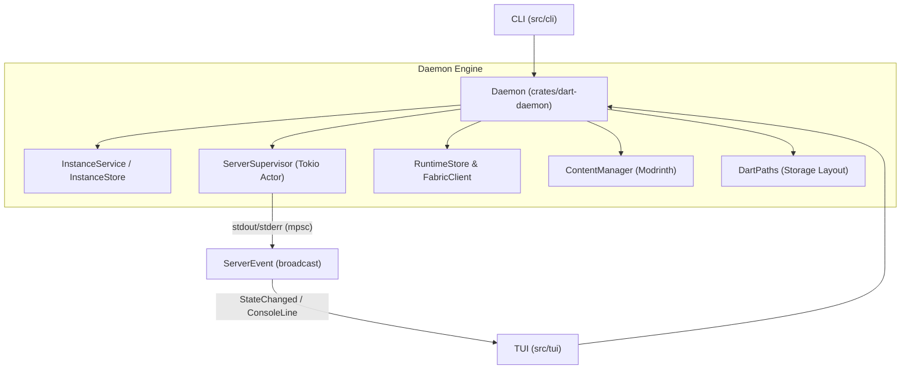

import { Cpu, Server, HardDrive, Shield, RefreshCw } from 'lucide-react';

The **`dart-daemon`** crate is the core engine of Dart. It acts as the single source of truth for all instance states, Fabric runtime resolution, process supervision, and Modrinth content management.

Both the **CLI** ([`src/cli`](file:///home/uttam/dart/src/cli/mod.rs)) and the **TUI** ([`src/tui`](file:///home/uttam/dart/src/tui/mod.rs)) consume this layer exclusively, ensuring complete parity and rock-solid state consistency.

---

## Core Subsystems

The daemon coordinates five major modular subsystems:



<Cards>
  <Card
    icon={<Server className="text-emerald-400" />}
    title="Instance Service"
    description="Validates instance IDs, manages configuration files (dart.toml), and executes instance lifecycles."
    href="/docs/daemon/instances"
  />
  <Card
    icon={<Cpu className="text-cyan-400" />}
    title="Process Supervisor"
    description="Spawns Java server processes asynchronously, manages standard I/O streams, and broadcasts live events."
    href="/docs/daemon/supervisor"
  />
  <Card
    icon={<RefreshCw className="text-amber-400" />}
    title="Fabric Runtime Store"
    description="Queries the Fabric Meta API, parses loader/installer combinations, and caches reusable launcher JARs."
    href="/docs/daemon/runtimes"
  />
  <Card
    icon={<HardDrive className="text-purple-400" />}
    title="Content Manager"
    description="Interfaces with the Modrinth v2 API, downloads mods/packs, and cryptographically validates SHA hashes."
    href="/docs/daemon/content"
  />
</Cards>

---

## Daemon Lifecycle & Construction

The daemon is bootstrapped through `Daemon::new(paths)`:

```rust
use dart_daemon::{Daemon, DartPaths};

#[tokio::main]
async fn main() -> Result<(), Box<dyn std::error::Error>> {
    let paths = DartPaths::new(std::path::PathBuf::from("~/.local/share/dart"));
    
    // Bootstraps daemon subsystems and returns an event receiver
    let (daemon, mut events) = Daemon::new(paths)?;

    // Listen to real-time server events (logs, state changes, failures)
    tokio::spawn(async move {
        while let Ok(event) = events.recv().await {
            match event {
                dart_daemon::ServerEvent::StateChanged { id, state } => {
                    println!("Instance {id} changed state to: {state:?}");
                }
                dart_daemon::ServerEvent::ConsoleLine { id, stream, line } => {
                    println!("[{id}] {line}");
                }
                dart_daemon::ServerEvent::OperationFailed { id, message } => {
                    eprintln!("Error on {id}: {message}");
                }
            }
        }
    });

    Ok(())
}
```

### Key Design Highlights

1. **Thread-Safe by Design**: `Daemon` implements `Clone` and is safe to pass across Tokio tasks and worker threads.
2. **Actor-Based Supervisor**: The `ServerSupervisor` isolates OS process management into an asynchronous Tokio actor loop, preventing blocking I/O from stuttering the TUI or CLI.
3. **Decoupled Event Broadcasting**: Console lines and state changes are delivered through a `tokio::sync::broadcast` bus with capacity for 1,024 events. Multiple listeners (TUI panes, log file recorders, webhooks) can subscribe independently without backpressure bottlenecks.
4. **Idempotent Storage**: Instance stores verify directory structures before writes and protect against concurrent configuration corruptions.

---

## Subsystem Guides

Explore each subsystem in detail:

* [Instances & Lifecycle State Machine](/docs/daemon/instances)
* [Process Supervision & Async I/O](/docs/daemon/supervisor)
* [Fabric Runtime Resolution & Caching](/docs/daemon/runtimes)
* [Modrinth Content Management](/docs/daemon/content)
* [Storage Layout & DartPaths](/docs/daemon/storage)
