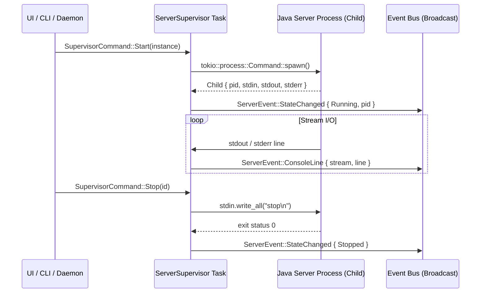

import { Callout } from 'fumadocs-ui/components/callout';

The [`ServerSupervisor`](file:///home/uttam/dart/crates/dart-daemon/src/process/mod.rs#L64) subsystem is an asynchronous Tokio-powered actor responsible for launching, monitoring, and communicating with Minecraft server Java processes.

---

## Actor Architecture

Managing operating system processes involves blocking operations (waiting on pipes, process signals, and termination timeouts). The supervisor avoids blocking the application by isolating child process management in a dedicated background task.



---

## Commands & Operations

Callers dispatch typed commands through an `mpsc::Sender<SupervisorCommand>`:

```rust
enum SupervisorCommand {
    Start(Instance),
    Stop(InstanceId),
    StopAll,
    KillAll,
    SendConsole { id: InstanceId, command: String },
}
```

### Available Actions

* **`Start(instance)`**: Validates that the instance isn't already running, builds the Java launch command (e.g., `java -Xmx4096M -jar fabric-server-launch.jar nogui`), attaches piped standard I/O streams, and spawns the child process.
* **`Stop(id)`**: Executes the graceful shutdown sequence for the target instance.
* **`StopAll`**: Broadcasts graceful stop signals to all active instances concurrently (invoked when exiting the TUI or shutting down the machine).
* **`KillAll`**: Immediately terminates all child processes (SIGKILL) in emergency exit scenarios.
* **`SendConsole { id, command }`**: Sends an arbitrary server console command (e.g. `op Steve`, `weather clear`, `save-all`) directly into the child process's standard input.

---

## Event Streaming: `ServerEvent`

The supervisor publishes state transitions and output lines over a non-blocking `tokio::sync::broadcast` channel:

```rust
#[derive(Clone, Debug, Eq, PartialEq)]
pub enum ServerEvent {
    StateChanged {
        id: InstanceId,
        state: InstanceState,
    },
    ConsoleLine {
        id: InstanceId,
        stream: OutputStream, // Stdout or Stderr
        line: String,
    },
    OperationFailed {
        id: InstanceId,
        message: String,
    },
}
```

### Benefits of Broadcast Distribution
* **Zero Pipe Lockup**: Output streaming uses asynchronous line-buffering (`tokio::io::BufReader`).
* **Multi-Subscriber Support**: Both the TUI console viewer and an optional file logger can subscribe to the identical event stream without interfering with each other.
* **Stream Segregation**: Standard output and error output are tagged via `OutputStream::Stdout` and `OutputStream::Stderr`, allowing the UI to highlight crash traces and warnings in red.

---

## Graceful Shutdown Protocol

Minecraft servers maintain in-memory chunks and entity states that must be flushed to disk upon exit. Forcible kills (`SIGKILL`) risk corrupting `level.dat` or region files.

Dart's shutdown protocol:
1. **Console Signal**: Dart writes `stop\n` into the child process's standard input pipe.
2. **Grace Period**: The supervisor starts an asynchronous timer while listening for the process exit signal.
3. **Escalation**: If the process does not terminate within the shutdown window (default: 15 seconds), Dart sends `SIGTERM`.
4. **Final Fallback**: If the process remains hung, `SIGKILL` is issued to release system memory and locked ports.
